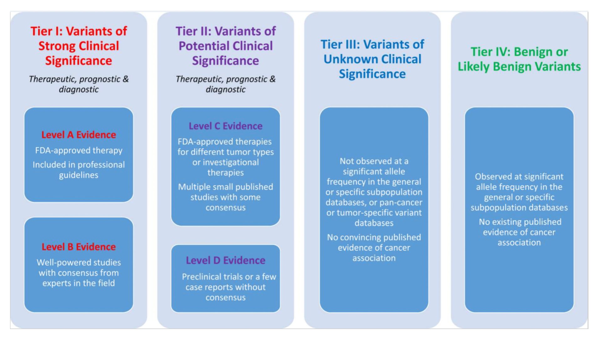

# Resources, SOPs and Guidelines for the Interpretation of Somatic Variants 

## Learning Objectives

This chapter will cover:  

- {AMP/ASCO/CAP guidelines}
- {ClinGen/CGC/VICC SOP}
- {Cancer Variant Knowledgebases and their limitations}

## AMP/ASCO/CAP guidelines

This section will introduce the AMP/ASCO/CAP guidelines for the Interpretation and Reporting of Sequence Variants in Cancer [@Li2017].

### AMP Tiers and Levels

This subsection will introduce the concept of AMP Tiers and Levels

## ClinGen/CGC/VICC Oncogenicity SOP

This section will introduce the Standards for the classification of pathogenicity of somatic variants in cancer (oncogenicity)[@Horak2022].

## Knowledgebases

This section will introduce relevant resources for Somatic Cancer variant interpretation including [COSMIC](https://cancer.sanger.ac.uk/cosmic), [ClinVar](https://www.ncbi.nlm.nih.gov/clinvar/), [oncoKB](https://www.oncokb.org/), others. 

