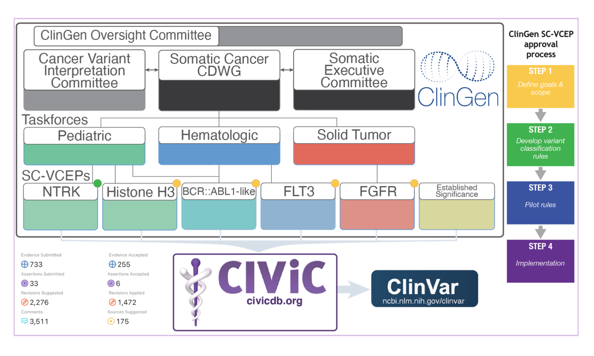

# Introduction to ClinGen

## Learning Objectives

This chapter will summarize:

- The ClinGen Organization
- ClinGen Somatic Cancer Variant Curation Expert Panels

## ClinGen Somatic 

The ClinGen organization, which leverages expert working groups to tailor guidelines for specific genes and provide publicly curated germline variant interpretations, has developed a parallel effort in the somatic space under the [Somatic Cancer Clinical Domain Working Group](https://www.clinicalgenome.org/working-groups/clinical-domain/somatic-cancer-cdwg/). Multiple ClinGen Somatic Cancer Variant Curation Expert Panels (SC-VCEPs) are being developed around different genes or disease groupings (FGFR, NTRK, etc), and undergoing a four step process for approval. SC-VCEP somatic curation follows data models which incorporate the above mentioned AMP/ASCO/CAP and ClinGen/CGC/VICC guidelines for clinical relevance and oncogenicity, which may be tailored for specific genes and disease contexts.The [CIViC knowledgebase](https://civicdb.org), discussed below, has been selected as the primary database and curation interface for SC-VCEP variant classifications.

