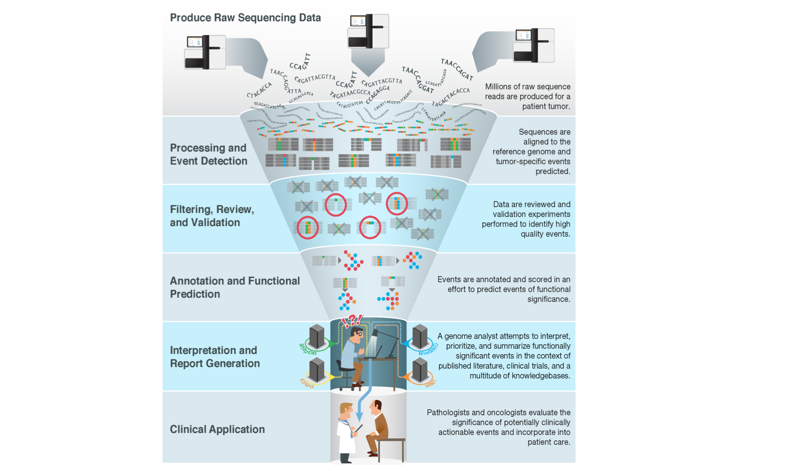

# Introduction

## Motivation

With the advent of massively parallel sequencing, millions of raw sequence reads can now be easily produced for a patient's tumor. Largely automated pipelines exist to process these raw data, detect various types of molecular alterations (or variants), filter and review to identify high-confidence calls, and annotate these variants for functional significance. However, a major bottleneck remains at the variant interpretation stage. Genome analysts, molecular pathologists, clinical geneticists, laboratory geneticists and others are faced with a deluge of variants of potential relevance [@Good2014]. These variants must be manually reviewed and intersected with a vast ecosystem of knowledgebases and biomedical literature to provide current interpretation of their relevance for clinical application.

## Target Audience  

The course is intended for anyone seeking a better understanding of current best practices in somatic cancer variant interpretation. This might include clinical geneticists, laboratory geneticists, molecular pathologists, oncologists, or other cancer care providers or cancer researchers.

## Curriculum  

This course will teach learners to:

- Understand key concepts of somatic cancer variant interpretation
- Introduce key SOPs and guidelines for classifying the clinical relevance and oncogenicity of somatic cancer variants
- Introduce ClinGen Somatic Cancer efforts
- Describe somatic variant knowledgebases
- Introduce CIViC as a curation platform for somatic variant interpretation
