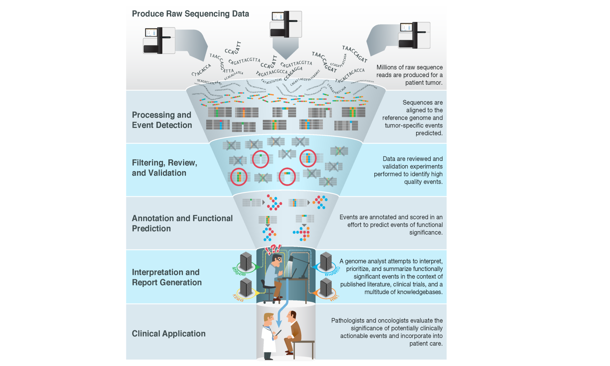

# Introduction to Somatic Variants 

## Learning Objectives

This chapter will cover:  

- Somatic Variant Interpretation Bottleneck Problem
- Next Generation Sequencing Techniques
- Human Genome Reference
- Common Variant Types
- Variant Representation

## The Bottleneck Problem in Cancer Variant Interpretation

As next generation, massively parallel sequencing of tumor genomes has become integrated into clinical practice, a so-called bottleneck problem has arisen, where a large number of somatic tumor sequence variants need to be interpreted for their potential clinical impact. 

In order to address this problem, databases containing information on the clinical impact of tumor variants have been created. These databases may be the result of private efforts and siloed for use by a particular group. Some efforts curate knowledgebases available to the community with access fees that go towards funding further curation. Yet another model is to create free public knowledgebases for variant clinical interpretation which leverage public curation and expert moderation. 

The biomedical literature has grown exponentially, including literature reporting new variants in cancer. This compounds the variant interpretation bottleneck as the number of variants in need of interpretation is not only large but also ever growing.

The Genomic landscape of many tumor types has been explored, with the number of coding variants in a tumor type ranging from a few to thousands. Individuals carry an inherited diploid genotype, referred to as germline, shared across all cells, containing common and rare variants relative to the human population. Individual cells in the body also develop spontaneous mutations, which are called somatic variants. Regularly dividing cells are especially susceptible to acquiring somatic mutations over the lifetime of an organism. As cells accumulate somatic mutations, they can become susceptible to precancerous or cancerous transformation. This is generally the result of mutations which disrupt the function of Tumor Suppressor genes, which are genes whose protein product functions within cells to regulate and halt the cell cycle, induce cellular differentiation, promote cell death via apoptosis, or other mechanisms which control cellular potential for malignancy. Cancer driving, or oncogenic mutations to tumor suppressors are generally of a reduced function or loss of function (LOF) type.  

Mutations may also promote cancer transformation via the activation of oncogenes, which are genes whose protein product is usually involved in promoting cellular growth in a regulated fashion, and can help drive uncontrolled growth when regulation is removed. Oncogenes are often part of growth signaling pathways such as those involving MAP or AKT kinases. A key phenomenon often observed with activation of oncogenes is termed oncogene addiction. This describes a phenomena whereby an activated oncogene drives uncontrolled cellular proliferation, but the cells become "addicted" to the presence of this oncogene, in that survival is dependent on its presence. This can be demonstrated with studies where knockdown of the oncogene, or inhibition of its function via inhibitors, induces cellular death. Oncogene addiction of driver mutations is a key mechanism explored in personalized cancer therapeutics, where the discovery of activated oncogenes in a tumor via sequencing opens up the possibility of targeted therapy for the patient. A third class of mutations key to cancer treatment are resistance mutations. These mutations typically arise during drug treatment and often interfere with the ability for a drug to bind effectively to its target. Drug resistance may also be induced by mutations or alterations to cancer cells that activate other pathways, circumventing the drug's effectiveness. The final major class of variants found in somatic tumors are passenger, or benign mutations. These variants may induce no important change to cellular behavior, or induce changes to the cell that play no role in promoting tumor formation, growth, survival, or any other hallmarks associated to cancer. 

Tumor variants may be hard to detect due to having low allelic fractions and tumor heterogeneity, making variants difficult to distinguish from noise in the assays. Contamination from normal tissue also contributes to this effect. Further difficulties in detection arise from degradation associated to sample storage methods such as when working with formalin-fixed and paraffin-embedded (FFPE) samples.

## Sequencing Background

Genome sequencing work performed over multiple decades allowed for the first iteration of the human genome reference in the early 2000s[@HumanGenome2001], followed by sequencing of the first tumor genome[@Ley2008].  

This work has been greatly aided by the introduction of next generation sequencing (NGS). NGS techniques scale up sequencing to massively parallel processes, numbering in the millions. NGS has largely been performed using techniques based on short-read generation (e.g., 150 bp). These short reads are aligned to a reference genome for analysis and discovery of variants in the sample. New technologies now utilize long multi-kilobase reads, and these platforms can sometimes be used for de novo assembly approaches, without alignment to a reference. These long read techniques allow for long-range haplotype analysis. 

Short read technologies typically utilize a sequencing by synthesis (SBS) approach, which involves reading millions of parallel sequencing reactions utilizing fluorescent-labeled nucleotides during the synthesis of a complementary DNA strand to a short fragment. Due to advantages in cost and throughput, short read sequencing is currently predominant in clinical applications. Therefore, clinical workflows to analyze NGS tumor data involve alignment to a reference genome followed by application of variant calling algorithms. Alignment data can be viewed using applications such as IGV (see Figure). Alignment algorithms allow identification of a range of different classes of variants. 

### Human Genome Reference

The human genome reference most commonly used, at present, is provided by the Genome Reference Consortium (GRC). The official name for the current GRC human reference genome is Genome Reference Consortium Human Build 38. It is unofficially called hg38 in some resources. 

This reference has high base-pair accuracy and good representation of repetitive and segmentally duplicated genomic regions. The assembly was generated with Sanger sequencing methods and large insert BAC clones (>150 kb inserts). DNA from multiple donors was used. The haplotypes from the different donors create different regions whose borders coincide with the underlying clone boundaries.

## Common Variant Types

The variant types usually encountered when sequencing tumors are listed below.

Single nucleotide variants (SNVs) are a change of a single nucleotide in DNA, and are the most common variant found. In cancer, tumor (somatic) SNVs are best detected in comparison to a sample of germline DNA obtained using normal tissue from the same patient. SNVs are also present as natural variation in the germline among individuals and different human populations. Common germline variation is considered to be at a rate of approximately 1% or higher. In protein coding regions, SNVs can result in silent, missense, or nonsense mutations. Silent mutations alter the codon in a way that results in the same amino acid being produced (e.g. CCA and CCG both result in Proline). These mutations usually do not effect cell behavior unless the altered region has a secondary regulatory function. Missense mutations are changes in protein structure that replace one amino acid with another. These mutations are usually denoted with the notation A123B, where A is the original amino acid, 123 is the position of the amino acid in the protein, and B is the new amino acid change. The consequences of missense mutations range from minimal passenger mutations to oncogenic driver mutations (e.g. EGFR L858R). Missense mutations may also introduce premature stop codons (e.g. TGC -> TGA). This results in a nonsense mutation. The consequences of nonsense mutations are usually a large or complete loss of protein function, as all parts of the protein downstream of the premature stop are no longer translated.  

Small insertions and deletions (indels) are the second most common form of mutation found both in tumors, and occurring as germline variation in the human population. Indels are usually considered to be insertions and deletions of 50 base pairs or less. In protein coding regions, indels can generate in-frame changes to the amino acid structure of a protein when the insertion or deletion is a multiple of three base pairs, resulting in the addition or loss of one amino acid per three base pairs but preserving the coding frame of downstream bases. Indels can also result in frameshift mutations when the insertion or deletion in a coding region is not a multiple of three. These mutations alter the reading frame, resulting in a radical change to the amino acid sequence downstream of the mutation, usually resulting in protein termination and a non-functional protein product.  

Translocations and fusions are a relatively common variant type found in cancer. Translocations are exchanges of large regions of DNA between different chromosomes, or between different regions of the same chromosome. Translocations may have breakpoints that occur in the middle of two different genes, resulting in fusions that have exons from both genes. A well known fusion results from the Philadelphia Chromosome, first identified in 1973 [@Rowley1973], which forms when chromosome 9 and chromosome 22 break and exchange large regions. This results in a fusion protein consisting of parts of the BCR gene and the ABL1 kinase gene, including the active kinase domain. The presence of BCR causes tetramer formation, which in turn activates the ABL1 kinase in a disregulated manner, driving oncogenic tyrosine kinase signaling. This fusion drives Chronic myeloid leukemia (CML) and is a driver that occurs in other cancer types as well. Targeted therapies against BCR::ABL1, such as imatinib, have been developed as a result of the discovery of this fusion and its driver properties [@Mughal2016]. 

A different type of genomic variant consists of copy number variants (CNVs) or copy neutral loss of heterogeneity (CNLOH). Copy number variants consist of losses or gains of large regions of chromosomes. Losses are usually deletions of genomic regions, and gains are usually two or larger fold duplications of genomic regions. These sorts of variants effect large numbers of genes and play a role in cancer. CNLOH usually results from the replacement of a large stretch of DNA on a chromosome with the same stretch of DNA derived from the homologous chromosome in the same cell. This causes a loss of heterozygosity as all DNA in this region is now identical between both homologous chromosomes, but there is no change in copy number of the genes in this region since there were no losses or gains in the DNA of this region. 

## Variant Representation and Classification

There are multiple ways to represent, describe, name, and disambiguate variants. Resources like the ClinGen Allele Registry attempt to provide an unambiguous central resource defining particular variants, both at the level of exact DNA changes referencing specific genome build, and at more general levels such as protein changes (e.g. EGFR L858R). The Human Genome Variation Society (HGVS) provides another widely adopted solution, which is a nomenclature for the representation of variants which is both human readable and also offers exact information on the variant.

For germline variant classification, a set of robust processes, data models, and guidelines have been developed. However, with the increased adoption of tumor sequencing in clinical practice, a parallel set of resources for interpretation of somatic variants are equally important.

Systems for classifying germline variant pathogenicity, such as those developed by ACMG and AMP, have been adopted and have influenced subsequent developments for somatic variants. Key differences exist between these two areas of variant interpretation and classification, both in biology and clinical actionability.

In germline variant interpretation, emphasis is placed on the causal relation between the gene's variants and the associated disease. When these relations are not well defined, clinical action related to the variant is not escalated. In contrast, in somatic variants, while the causal underlying cancer biology of a variant is of clear interest, in clinical application the observation of variant actionability is prioritized above clear knowledge of disease mechanisms. If a variant is shown to induce tumor sensitivity to a certain drug, this will escalate and expand testing of the drug against the variant, and increase clinical adoption of the drug. Studies of the underlying biology will follow and deepen mechanistic understanding and guide the development of further drugs and potential variants, but may not directly influence clinical decisions. Another key difference occurs in the biology of germline and somatic tumor variants. Many somatic variants found in tumors would be embryonic lethal if they occurred in the germline.

In bioinformatics a common file type used for variant representation is the Variant Call Format (VCF) which is a specific file format for storing gene sequence variations. This format developed during large scale sequencing and genotyping projects such as the 1000 Genomes Project or the newer gnomAD database of variant frequencies in the human population [@Chen2022].  

The VCF format is flexible and allows for representation of many different variant types including those described above. A problem in variant representation in VCF files and other areas of bioinformatics is the non unique way variants can be described. The same variant can be described using reference and alternate alleles of different length and position relative to the reference genome. Different methods attempt to define rules for consistent alignment and parsimony of the variant representation [@Tan2015]. The particular rules for a parsimonious and consistently aligned variant representation are described in various online resources such as this wiki page: https://genome.sph.umich.edu/wiki/Variant_Normalization.
